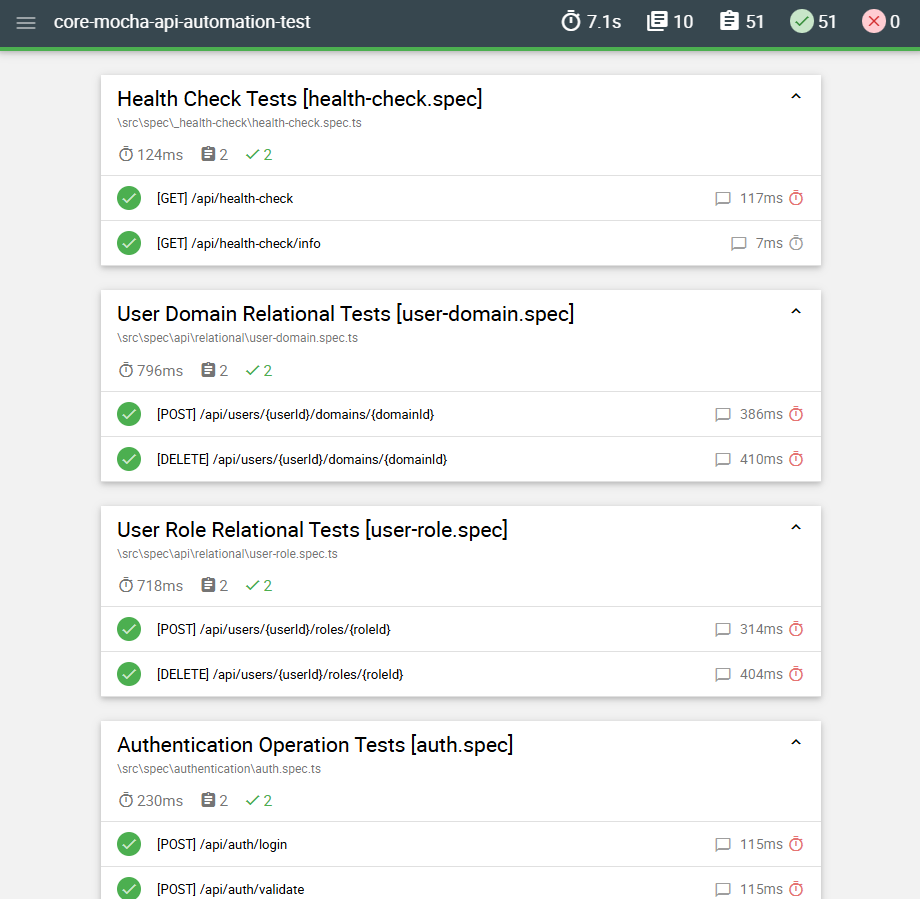

<h1 id="top" align="center">Core  Mocha <br/> API Automation Test</h1>

<br>

<div align="center">
    
</div>

## 🔍 Table of Contents

- [Software Versions](#software-versions)
- [Features](#features)
- [Next Release Features](#next-release-features)
- [System Startup](#system-startup)
- [Test Report](#test-report)
- [Manual Testing](#manual-testing)

<br/>

<h2 id="software-versions">🏷️ Software Versions</h2>

| Software     | Version    |
|--------------|------------|
| NodeJS       | 22.11.0    |
| npm          | 10.8.3     |

<br/>

<h2 id="features">🔥 Features</h2>

- **Parallel and Standard Modes:** Run tests in parallel for faster execution or in standard mode.
- **Auto-generated Reports:** Automatically generates detailed reports summarizing test results and highlighting any issues.
- **Postman Scripts:** Includes Postman scripts for testing all API endpoints, enabling manual testing and validation of functionality.
- **Database Cleanup:** Ability to clean database data, ensuring the environment is reset and ready for the next test run.
- **Comprehensive API Testing:** Tests all API endpoints for correctness.
- **Environment Variables**: Support for environment variables to manage configurations.

<br/>

<h2 id="next-release-features">🚧 Next Release Features</h2>

- Not planning further features.

<br/>

<h2 id="releases">🚢 Releases</h2> 

&nbsp; [](https://github.com/ahmettoguz/core-mocha-api-automation-test/tree/v1.0.0)

<br/>

<h2 id="system-startup">🚀 System Startup</h2>

Refer to the [`core-java-spring-boot-rest-api`](https://github.com/ahmettoguz/core-java-spring-boot-rest-api) repository for detailed instructions on running the API as specified in the system startup.

Modify `.env` file for further configurations.

Install dependencies

```
npm i
```

Run parallel tests and clean database

```
npm run test:parallel:clean
```

Run parallel tests

```
npm run test:parallel
```

Run sequential tests

```
npm run test
```

Run spec tests in parallel

```
npm run spec:parallel
```

Run spec tests in sequential

```
npm run spec
```

<br/>

<h2 id="test-report">🐛 Test Report</h2>

Mochawesome is integrated into the project to generate comprehensive test reports. The reports provide detailed insights into test execution, including the results of individual tests, their durations, and any issues encountered.

After running the tests, you can view the generated report at `/mochawesome-report/mochawesome.html`. This report is automatically generated upon test completion.

Demonstration of the Report:

<div align="center">
    
</div>

<br/>

<h2 id="manual-testing">🔬 Manual Testing</h2>

To run the Postman tests, first import the Postman collection file from the path `./src/postman-request` into Postman by selecting the `Import` option. After importing, locate the collection in Postman, execute the individual requests for each. Review the responses to ensure that the endpoints are functioning as expected.

<br/>

### [🔝](#top)
